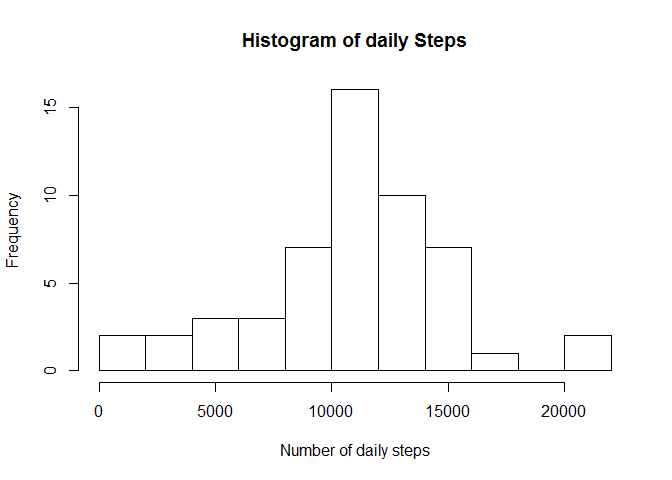
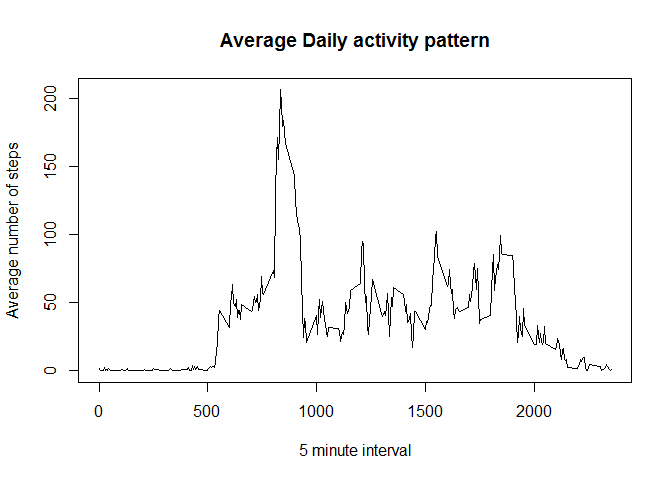
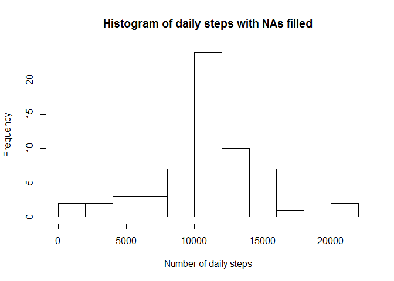
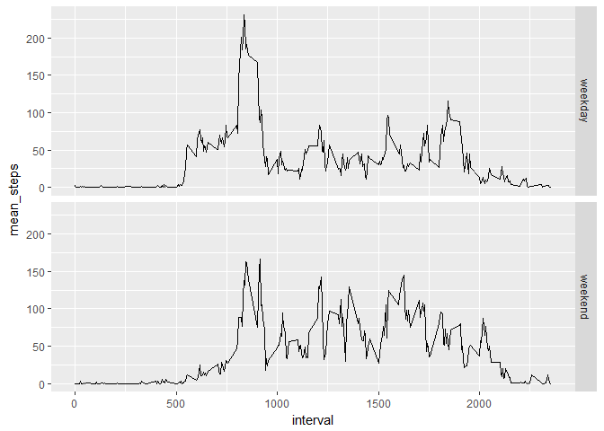

# Reproducible Research: Peer Assessment 1

## Introduction

It is now possible to collect a large amount of data about personal movement using activity monitoring devices such as a Fitbit, Nike Fuelband, or Jawbone Up. These type of devices are part of the "quantified self" movement - a group of enthusiasts who take measurements about themselves regularly to improve their health, to find patterns in their behavior, or because they are tech geeks. But these data remain under-utilized both because the raw data are hard to obtain and there is a lack of statistical methods and software for processing and interpreting the data.

This assignment makes use of data from a personal activity monitoring device. This device collects data at 5 minute intervals through out the day. The data consists of two months of data from an anonymous individual collected during the months of October and November, 2012 and include the number of steps taken in 5 minute intervals each day.

## Goals

For this assignment, we'll analyse this dataset to get an exploratory understanding of how the activity level (particularly steps) behaves with respect to time (During a single day, during different days of the week and across days).

## Loading and preprocessing the data


Firstly, let's load the dataset to R


```r
# Making sure we're in US date

Sys.setlocale("LC_TIME", "C")
```

```
## [1] "C"
```

```r
# Reading data

current_directory = getwd()

if(!file.exists("./activity.csv")) {

    file_url = "https://d396qusza40orc.cloudfront.net/repdata%2Fdata%2Factivity.zip"

    download.file(file_url,destfile = "./activity.zip")

    unzip("./activity.zip",exdir=getwd())

}

data_ex= read.csv("./activity.csv")
```

## First look into the data

Now, let's take a look at the first observations


```r
head(data_ex)
```

```
  steps       date interval
1    NA 2012-10-01        0
2    NA 2012-10-01        5
3    NA 2012-10-01       10
4    NA 2012-10-01       15
5    NA 2012-10-01       20
6    NA 2012-10-01       25
```

## Summary of variables

From the last output, we observe that the steps variable contains only NAs in the first set of observations. Let's make a summary to get an overview about all observations


```r
summary(data_ex)
```

```
     steps                date          interval     
 Min.   :  0.00   2012-10-01:  288   Min.   :   0.0  
 1st Qu.:  0.00   2012-10-02:  288   1st Qu.: 588.8  
 Median :  0.00   2012-10-03:  288   Median :1177.5  
 Mean   : 37.38   2012-10-04:  288   Mean   :1177.5  
 3rd Qu.: 12.00   2012-10-05:  288   3rd Qu.:1766.2  
 Max.   :806.00   2012-10-06:  288   Max.   :2355.0  
 NA's   :2304     (Other)   :15840                   
```

From this process it seems clear that the only variable with NAs is steps, but there are some records with values on it, nonetheless


## What is mean total number of steps taken per day?

To answer this question, we firstly need to process our data in order to arrange the observations so that we have the sum of steps for each day.


```r
library(dplyr)
data_grouped_by_day = group_by(data_ex,date)
data_summarized = summarise(data_grouped_by_day,total_steps = sum(steps))
head(data_summarized)
```

```
# A tibble: 6 × 2
        date total_steps
      <fctr>       <int>
1 2012-10-01          NA
2 2012-10-02         126
3 2012-10-03       11352
4 2012-10-04       12116
5 2012-10-05       13294
6 2012-10-06       15420
```

### Histogram of daily steps


```r
hist(data_summarized$total_steps,breaks = 10,main = "Histogram of daily Steps",xlab = "Number of daily steps")
```

<!-- -->

### Mean daily steps


```r
mean(data_summarized$total_steps,na.rm = TRUE)
```

```
[1] 10766.19
```

### Median daily steps


```r
median(data_summarized$total_steps,na.rm = TRUE)
```

```
[1] 10765
```

## What is the average daily activity pattern?

Another interesting aspect we're going to analyse is the activity pattern "intraday". This will let us know how much activity is done during the day on average.

Firstly, as in our previous analysis, let's process the dataset so that we get a table with the average daily steps for each 5 minute interval


```r
data_grouped_by_interval = group_by(data_ex,interval)
data_daily_average = summarise(data_grouped_by_interval,mean_daily = mean(steps,na.rm = TRUE))

head(data_daily_average)
```

```
# A tibble: 6 × 2
  interval mean_daily
     <int>      <dbl>
1        0  1.7169811
2        5  0.3396226
3       10  0.1320755
4       15  0.1509434
5       20  0.0754717
6       25  2.0943396
```

### Time series plot of the daily activity pattern on each 5 min interval


```r
plot(data_daily_average$interval,
     data_daily_average$mean_daily,
     type = "l",
     main = "Average Daily activity pattern",
     xlab = "5 minute interval",
     ylab = "Average number of steps")
```

<!-- -->


### Interval with the maximum daily average number of steps

From looking at the plot, we see a clear peak around the 5 min interval number 800, so we procede to find the specific interval


```r
data_daily_average$interval[which.max(data_daily_average$mean_daily)]
```

```
[1] 835
```


## Imputing missing values

From our initial exploration, we noticed that there were some intervals and complete days with no steps recorded (NAs). This could introduce bias in our analysis. Therefore, we design a strategy to fill in those values and reduce that risk.

### Total number of NAs


```r
sum(is.na(data_ex$steps))
```

```
[1] 2304
```

### Strategy for filling in NAs

The strategy we will use for filling in missin values is using the average number of steps (rounded, so we get integers, as steps physically cannot take real numbers) for the interval when NAs are present. We have this information from the last analysis, so we basically use that dataset as a lookup table and procede to fill in every NA

### Applying strategy and creating new dataset with NAs filled in


```r
## Filling NAs using the rounded Daily (to transform it in an integer) average 
#at that 5 min interval as a filling criteria

data_ex_na_filled = data_ex

for(i in 1:length(data_ex_na_filled$steps)) {
    
    if(is.na(data_ex_na_filled$steps[i])) {
        
        data_ex_na_filled$steps[i] = round(data_daily_average$mean_daily[
            grep(data_ex_na_filled$interval[i],
                 data_daily_average$interval)[1]])
        
    }
    
}

head(data_ex_na_filled)
```

```
  steps       date interval
1     2 2012-10-01        0
2     0 2012-10-01        5
3     0 2012-10-01       10
4     0 2012-10-01       15
5     0 2012-10-01       20
6     2 2012-10-01       25
```

```r
tail(data_ex_na_filled)
```

```
      steps       date interval
17563     3 2012-11-30     2330
17564     5 2012-11-30     2335
17565     3 2012-11-30     2340
17566     1 2012-11-30     2345
17567     0 2012-11-30     2350
17568     1 2012-11-30     2355
```

```r
summary(data_ex_na_filled)
```

```
     steps                date          interval     
 Min.   :  0.00   2012-10-01:  288   Min.   :   0.0  
 1st Qu.:  0.00   2012-10-02:  288   1st Qu.: 588.8  
 Median :  0.00   2012-10-03:  288   Median :1177.5  
 Mean   : 37.38   2012-10-04:  288   Mean   :1177.5  
 3rd Qu.: 27.00   2012-10-05:  288   3rd Qu.:1766.2  
 Max.   :806.00   2012-10-06:  288   Max.   :2355.0  
                  (Other)   :15840                   
```

### Histogram of daily steps once filling NAs


```r
data_grouped_by_day_nafilled = group_by(data_ex_na_filled,date)
data_summarized_nafilled = summarise(data_grouped_by_day_nafilled,total_steps = sum(steps))
hist(data_summarized_nafilled$total_steps,
     breaks = 10,
     main = "Histogram of daily steps with NAs filled",
     xlab = "Number of daily steps")
```

<!-- -->


### Mean daily steps


```r
mean(data_summarized_nafilled$total_steps)
```

```
[1] 10765.64
```

### Median daily steps


```r
median(data_summarized_nafilled$total_steps)
```

```
[1] 10762
```

#### Do mean and median differ from previous dataset with NAs ignored?

The difference is minimal, with the dataset that ignored NAs yielding slightly higher mean and median than the dataset that filled in NAs


## Are there differences in activity patterns between weekdays and weekends?

To answer this question, we first must classify our dates in weekends and weekdays.


```r
# Classifying days in weekdays and weekends


data_ex_na_filled = mutate(data_ex_na_filled,weekday = weekdays(as.Date(date)))


data_factor = mutate(data_ex_na_filled,
                    classification=ifelse(weekday == "Saturday"| weekday == "Sunday","weekend","weekday"))

data_interval = group_by(data_factor,interval,classification)

data_interval_summarized = summarise(data_interval,mean_steps = mean(steps))
```

### Plotting Average daily steps with respect to 5 minute interval for regular weekdays and weekends


```r
# Making a panel plot of the average daily activity pattern on weedays and
# weekends

library(ggplot2)

plot = ggplot(data = data_interval_summarized,
             aes(interval,mean_steps))

plot = plot + geom_line() + facet_grid(classification ~ .)

plot
```

<!-- -->

We can visually asses a couple of patterns that appear to arise from the panel plot

-Firstly, activity during the weekdays is more intense earlier and peaks more strongly at around 800 interval

-Activity during the weekends is more homogeneous and overall more intense throughout the 5 min interval domain, being slightly less intense earlier, compared to weekdays and slightly more intense the rest of the day, without an extreme peak at some point, unlike weekdays
